# Django Oscar - Architectural Analysis

This document provides a comprehensive architectural analysis of Django Oscar, an e-commerce framework for Django. It includes C4 diagrams, workflow diagrams, and sequence diagrams for critical areas of the system.

## Table of Contents

1. [C4 Context Diagram](#c4-context-diagram)
2. [C4 Container Diagram](#c4-container-diagram)
3. [C4 Component Diagrams](#c4-component-diagrams)
4. [Workflow Diagrams](#workflow-diagrams)
5. [Sequence Diagrams](#sequence-diagrams)

---

## C4 Context Diagram

The Context diagram shows Django Oscar within its broader ecosystem, including external systems and users.

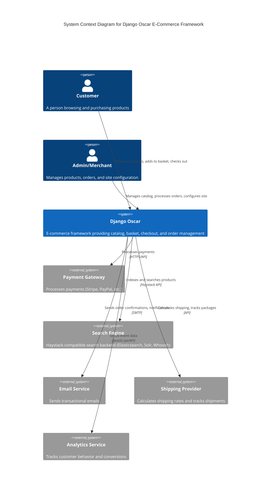

---

## C4 Container Diagram

The Container diagram shows the major technical components within Django Oscar.

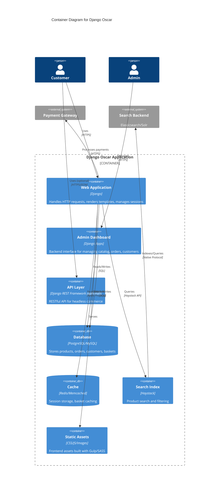

---

## C4 Component Diagrams

### Catalogue Component Diagram

Shows the internal structure of the Catalogue app, which manages products and categories.

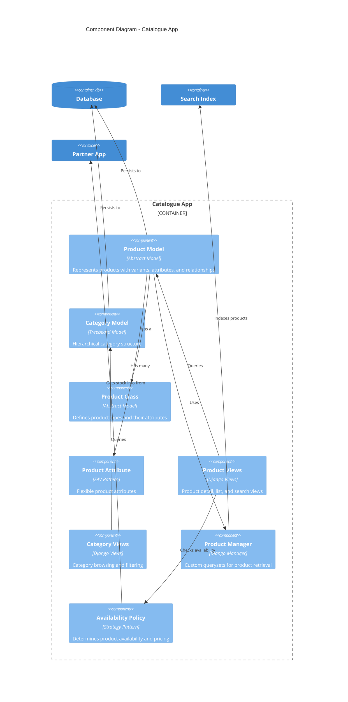

### Checkout & Order Component Diagram

Shows the checkout and order placement flow components.

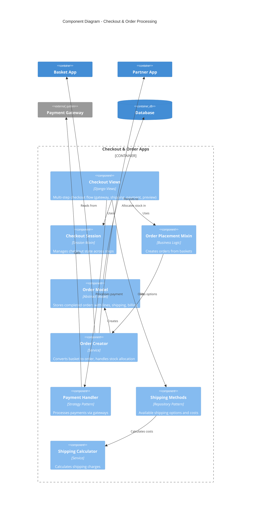

### Dynamic Class Loading Component Diagram

Shows Oscar's customization mechanism through dynamic class loading.

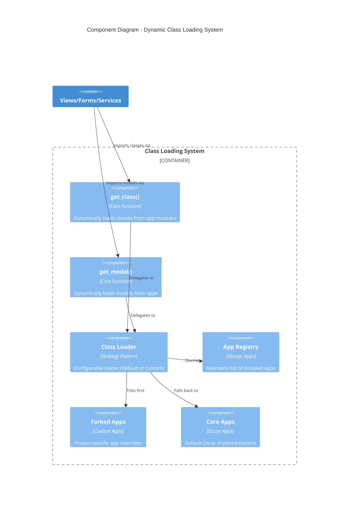

---

## Workflow Diagrams

### Complete Checkout Process

End-to-end workflow from basket to order confirmation.

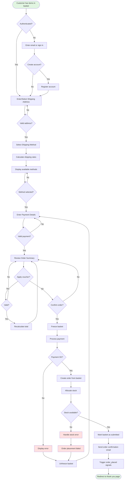

### Product Customization Flow (App Forking)

Workflow for customizing Oscar apps using the fork mechanism.

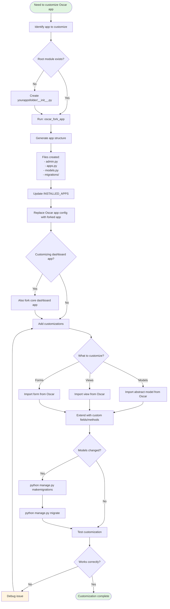

### Offer and Voucher Application

How promotions and discounts are applied to baskets.

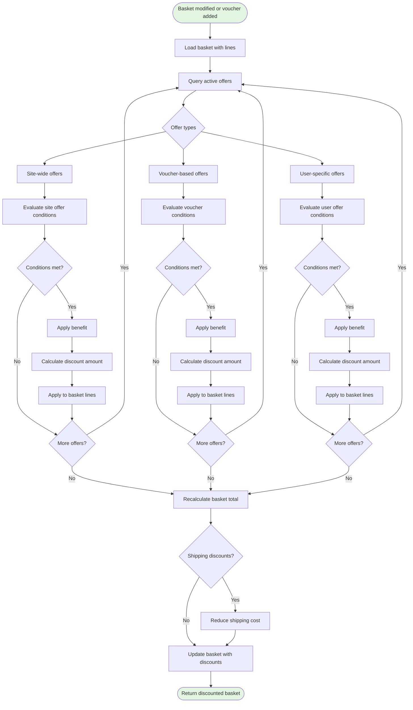

---

## Sequence Diagrams

### Add Product to Basket

Interaction flow when a customer adds a product to their basket.

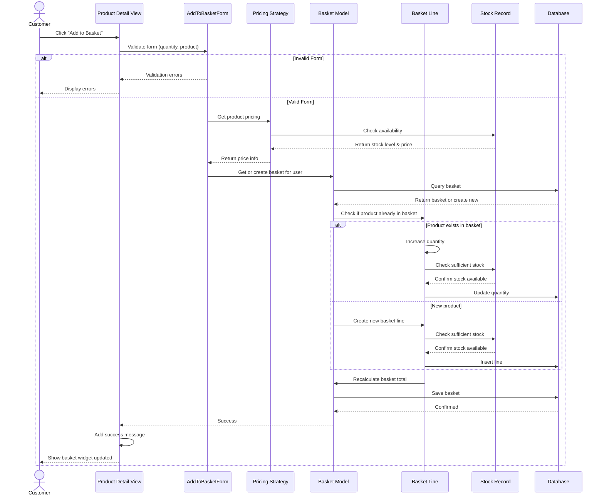

### Complete Checkout and Order Placement

Detailed sequence of placing an order through checkout.

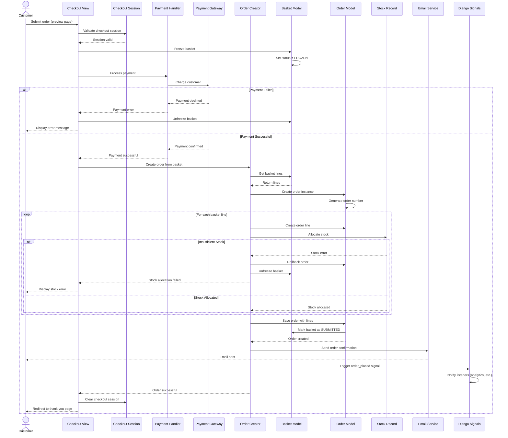

### Dynamic Class Loading Mechanism

How Oscar's dynamic class loading works to support customization.

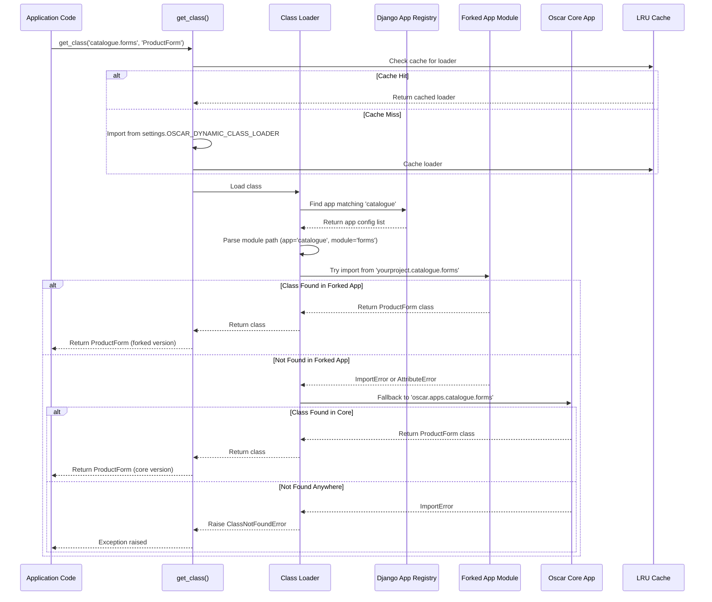

### Product Search Flow

How product search works through Haystack integration.

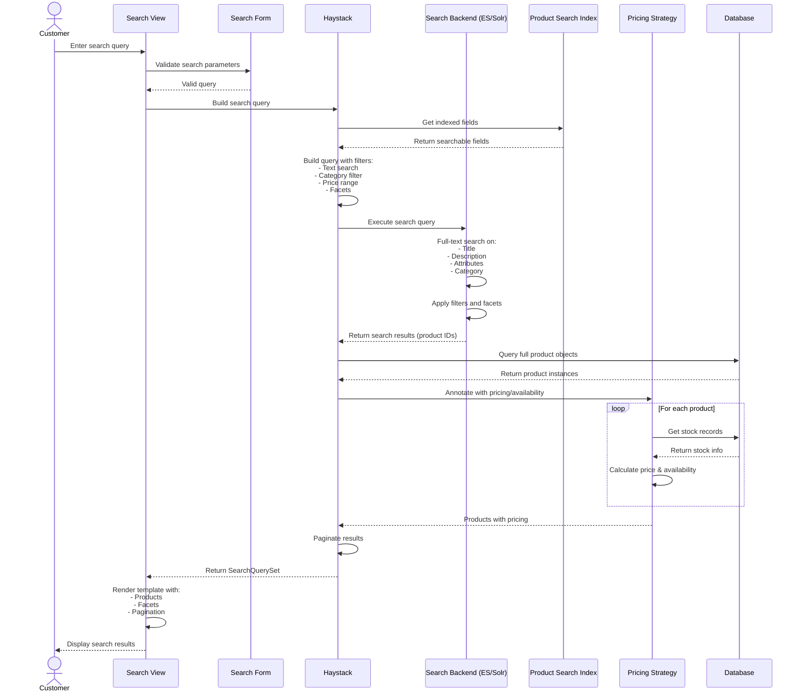

### Stock Allocation and Order Fulfillment

Managing inventory during order placement and fulfillment.

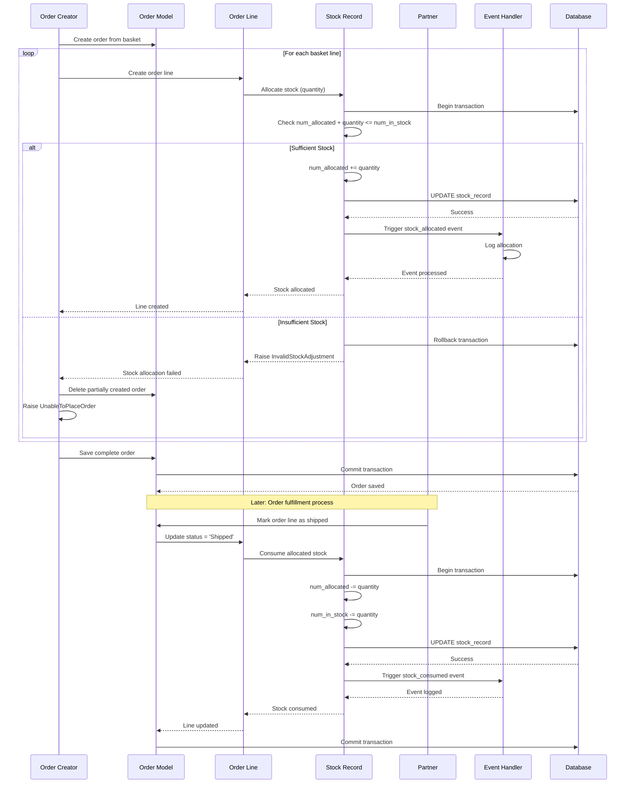

---

## Key Architectural Patterns

### 1. Abstract Model Pattern
Oscar uses abstract base models that can be extended by forking apps. This allows adding custom fields without modifying core code.

**Example**: `AbstractProduct` in `catalogue.abstract_models` → Extended in forked app → Concrete `Product` model

### 2. Dynamic Class Loading
Almost all classes are loaded dynamically using `get_class()` and `get_model()`, enabling customization by module path resolution.

**Resolution order**: Forked App → Core App → Raise Exception

### 3. Strategy Pattern
Used extensively for:
- **Pricing Strategy**: How product prices are determined
- **Availability Policy**: How stock availability is checked
- **Shipping Methods**: How shipping costs are calculated
- **Payment Handlers**: How payments are processed

### 4. Repository Pattern
The Shipping Repository provides available shipping methods based on basket and customer context.

### 5. Signal-Based Events
Django signals are used throughout for extensibility:
- `order_placed` - When an order is successfully created
- `start_checkout` - When checkout process begins
- `basket_addition` - When product added to basket
- `order_line_status_changed` - When order line status changes

### 6. Session-Based State Management
Checkout process uses session storage to maintain state across multiple request/response cycles.

---

## Database Schema Overview

### Core Entities and Relationships

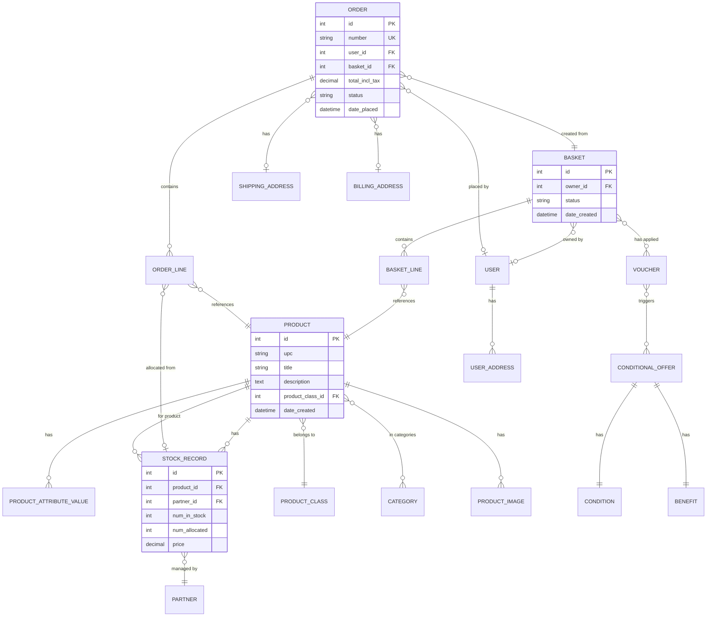

---

## Conclusion

Django Oscar's architecture is built around flexibility and customization. The dynamic class loading system, abstract models, and forking mechanism allow developers to customize any part of the framework without modifying core code. This makes it suitable for a wide range of e-commerce scenarios, from simple shops to complex B2B platforms.

Key architectural strengths:
- **Extensibility**: Fork and customize any app without touching core code
- **Modularity**: Clear separation of concerns across apps
- **Flexibility**: Strategy pattern for pricing, shipping, payment
- **Domain-driven**: Models reflect e-commerce domain concepts
- **Django-native**: Leverages Django's app system, signals, and ORM

For implementation details, refer to the source code in `src/oscar/` and the official documentation.
