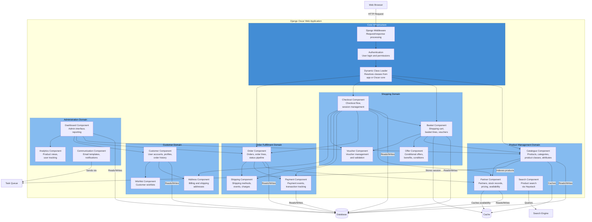

# C4 Component Diagram - Django Oscar Web Application

## Component Level (Level 3)

This diagram shows the internal components of the Django Oscar Web Application, organized by domain.



## Component Descriptions

### Core Infrastructure

#### Dynamic Class Loader
**Responsibilities**:
- Resolves classes at runtime from application or Oscar core
- Implements `get_class()` and `get_model()` functions
- Enables customization without forking

**Key Functions**:
```python
get_class(module_path, class_name)  # For views, forms, etc.
get_model(app_label, model_name)     # For Django models
```

#### Django Middleware
**Responsibilities**:
- Request preprocessing
- Response postprocessing
- Session management
- CSRF protection
- Basket middleware (attaches basket to request)

#### Authentication
**Responsibilities**:
- User login/logout
- Permission checking
- Session management
- User model customization
- OAuth integration

### Product Management Domain

#### Catalogue Component
**Purpose**: Manages the product catalog

**Models**:
- `Product`: Core product model (standalone/parent/child)
- `ProductClass`: Product types (Book, DVD, etc.)
- `Category`: Hierarchical categories (tree structure)
- `ProductAttribute`: Dynamic attributes per product class
- `ProductImage`: Product images with ordering

**Views**:
- Product list view (category browsing)
- Product detail view
- Category view
- Search results view

**Key Features**:
- Hierarchical categories using django-treebeard
- EAV (Entity-Attribute-Value) pattern for product attributes
- Parent-child product relationships for variants
- Image management with ordering

**Relationships**:
- Products have StockRecords (via Partner component)
- Products belong to Categories
- Products have Attributes (defined by ProductClass)

#### Partner Component
**Purpose**: Manages fulfillment partners and stock

**Models**:
- `Partner`: Fulfillment partner entity
- `StockRecord`: Links product to partner with pricing/stock
- `StockAlert`: Alerts for low stock levels

**Key Features**:
- Multi-vendor support
- Stock allocation (two-stage: allocate → consume)
- Partner-specific pricing
- Stock level tracking (`num_in_stock`, `num_allocated`)

**Stock Management**:
```python
stockrecord.allocate(quantity)          # Reserve stock
stockrecord.consume_allocation(quantity) # Fulfill order
stockrecord.cancel_allocation(quantity)  # Cancel reservation
```

#### Search Component
**Purpose**: Product search integration

**Technology**: Django Haystack

**Features**:
- Full-text search
- Faceted search
- Search suggestions
- Multiple backend support (Whoosh, Solr, Elasticsearch)

**Integration**:
- Search indexes built from Catalogue models
- Updates via Celery tasks
- Caching of search results

### Shopping Domain

#### Basket Component
**Purpose**: Shopping cart management

**Models**:
- `Basket`: Shopping basket
- `BasketLine`: Items in basket
- `BasketLineAttribute`: Line-specific attributes

**Key Features**:
- Merges baskets on login
- Applies offers and vouchers
- Calculates totals with tax
- Supports line-level options
- Voucher application
- Shipping method selection

**Session Management**:
- Anonymous baskets stored in session
- Authenticated baskets stored in database
- Basket middleware attaches to request

#### Checkout Component
**Purpose**: Checkout flow orchestration

**Views**:
- Index view (checkout start)
- Shipping address view
- Shipping method view
- Payment details view
- Preview and place order view

**Features**:
- Multi-step checkout process
- Session-based state management
- Address validation
- Payment method selection
- Order preview
- Order placement

**Template Method Pattern**:
Base views define flow, subclasses customize steps.

#### Offer Component
**Purpose**: Promotional offers and discounts

**Models**:
- `ConditionalOffer`: Offer with conditions and benefits
- `Condition`: When offer applies (basket value, product, etc.)
- `Benefit`: Discount (percentage, absolute, shipping, etc.)
- `Range`: Products eligible for offer

**Offer Types**:
- Site offers (apply automatically)
- Voucher offers (require voucher code)
- Session offers (temporary)

**Application**:
- Applied during basket calculation
- Tracked at order level for reporting

#### Voucher Component
**Purpose**: Voucher/coupon management

**Models**:
- `Voucher`: Voucher code and usage limits
- `VoucherApplication`: Tracks voucher usage

**Features**:
- Single-use or multi-use vouchers
- Usage limits per customer
- Date-based availability
- Linked to offers

### Order Fulfillment Domain

#### Order Component
**Purpose**: Order processing and management

**Models**:
- `Order`: Main order model
- `OrderLine`: Individual order items
- `OrderNote`: Audit trail
- `OrderStatusChange`: Status history

**Key Features**:
- Status pipeline for workflow
- Immutable after creation
- Denormalized product data (preserves historical info)
- Separate billing/shipping addresses
- Order verification hash for anonymous viewing

**Status Pipeline**:
```python
OSCAR_ORDER_STATUS_PIPELINE = {
    'Pending': ('Being processed', 'Cancelled'),
    'Being processed': ('Complete', 'Cancelled'),
    ...
}
```

**Allocation Tracking**:
- Stock allocated on order placement
- Consumed on shipment
- Cancelled on order cancellation

#### Payment Component
**Purpose**: Payment event tracking

**Models**:
- `PaymentEvent`: Payment transaction
- `PaymentEventType`: Event types (Paid, Refunded, etc.)
- `PaymentEventQuantity`: Lines affected by event

**Features**:
- Records payment events, not processing
- Supports partial payments
- Links to shipping events
- Audit trail of transactions

**Payment Events**:
- Pre-auth
- Settle
- Refund
- Void

#### Shipping Component
**Purpose**: Shipping management

**Models**:
- `ShippingAddress`: Delivery address
- `ShippingEvent`: Shipping event (Shipped, Delivered, etc.)
- `ShippingEventType`: Event types
- `ShippingMethod`: Available shipping methods

**Features**:
- Multiple shipping methods
- Weight-based rates
- Country-based rates
- Event tracking (dispatched, delivered, returned)

**Shipping Events**:
- Dispatched
- Delivered
- Returned
- Lost

### Customer Domain

#### Customer Component
**Purpose**: Customer account management

**Models**:
- `User`: Django user model (customizable)
- `CustomerProfile`: Additional profile data
- `Notification`: Customer notifications

**Features**:
- Order history
- Address management
- Email preferences
- Account dashboard
- Password reset

#### Address Component
**Purpose**: Address management

**Models**:
- `UserAddress`: Saved customer addresses
- `Country`: Country data

**Features**:
- Multiple saved addresses
- Default billing/shipping addresses
- Address validation
- Country/region selection

#### Wishlist Component
**Purpose**: Customer wishlists

**Models**:
- `WishList`: Customer wishlist
- `WishListLine`: Items in wishlist

**Features**:
- Multiple wishlists per customer
- Add to basket from wishlist
- Public/private wishlists

### Administration Domain

#### Dashboard Component
**Purpose**: Store management interface

**Features**:
- Product management (CRUD)
- Order processing
- Customer management
- Reports and analytics
- Permission-based access
- Bulk operations

**Sections**:
- Catalogue management
- Order management
- Customer management
- Offer management
- Partner management
- Reports

#### Analytics Component
**Purpose**: User behavior tracking

**Models**:
- `ProductRecord`: Product view tracking
- `UserRecord`: User session data
- `UserProductView`: Views per user/product

**Features**:
- Product view tracking
- Score calculation for recommendations
- Integration with Google Analytics

#### Communication Component
**Purpose**: Email notifications

**Models**:
- `Email`: Sent email log
- `CommunicationEventType`: Email templates

**Features**:
- Template-based emails
- Variable substitution
- Attachments
- HTML and text versions
- Email queuing via Celery

## Key Interaction Patterns

### Product Display Flow
```
Browser → Middleware → Catalogue View
         → Catalogue Component → Partner Component (availability)
         → Database → Render Template → Response
```

### Add to Basket Flow
```
Browser → Basket View → Basket Component
         → Partner Component (check availability)
         → Offer Component (apply discounts)
         → Database → Update Session/DB
```

### Checkout Flow
```
Browser → Checkout Views → Basket Component
         → Address Component → Shipping Component
         → Payment Component → Order Component
         → Partner Component (allocate stock)
         → Communication Component (confirmation email)
```

### Order Fulfillment Flow
```
Dashboard → Order Component → Shipping Component
         → Partner Component (consume allocation)
         → Communication Component (shipping notification)
         → Task Queue (async email)
```

## Data Access Patterns

### Repository Pattern
Custom managers encapsulate complex queries:

```python
# Product queryset methods
Product.objects.browsable()  # Public products
Product.objects.base_queryset()  # Optimized query
```

### Strategy Pattern
Pricing and availability strategies:

```python
class Strategy:
    def fetch_for_product(self, product):
        # Returns pricing and availability
        pass
```

### Caching Strategy
- Category tree cached (rarely changes)
- Product availability cached per request
- Basket stored in session/cache
- Query result caching for expensive operations

## Security Layers

### View-Level Security
- Login required decorators
- Permission checking
- CSRF protection

### Model-Level Security
- Managers filter based on permissions
- User isolation
- Partner access restrictions

### Data Security
- Password hashing
- Order verification tokens
- Signed URLs for restricted access

## Extension Points

Each component can be customized:

1. **Model Extension**: Inherit from Abstract* models
2. **View Override**: Subclass Oscar views
3. **Form Customization**: Subclass Oscar forms
4. **Template Override**: Place templates in project
5. **URL Override**: Configure per-app URLs

## Dependencies Between Components

### Hard Dependencies
- Checkout depends on Basket, Order, Payment, Shipping
- Order depends on Partner (stock allocation)
- Basket depends on Catalogue, Offer, Voucher
- Dashboard depends on most components

### Loose Coupling
- Communication component is loosely coupled (signals)
- Analytics component observes via signals
- Search component indexes independently

## Performance Considerations

### Database Optimization
- Select/prefetch related queries
- Denormalized data in Order (immutable)
- Indexed foreign keys
- Query optimization in managers

### Caching Strategy
- Fragment caching for expensive renders
- Query result caching
- Category tree caching
- Basket caching

### Async Processing
- Email sending via Celery
- Search indexing via Celery
- Image processing via Celery
- Heavy reports via Celery
