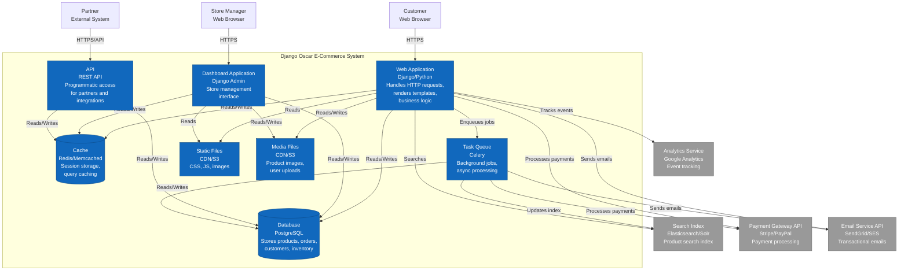

# C4 Container Diagram - Django Oscar E-Commerce System

## Container Level (Level 2)

This diagram shows the high-level technical building blocks (containers) that make up the Django Oscar system.



## Container Descriptions

### Web Application
**Technology**: Django, Python, Gunicorn/uWSGI

The main web application that serves the customer-facing storefront.

**Responsibilities**:
- Serves HTML pages to customers
- Handles product browsing and search
- Manages shopping basket
- Processes checkout flow
- Manages customer accounts
- Implements business logic
- Enforces security and permissions

**Key Components**:
- Django views and URL routing
- Template rendering engine
- Form processing and validation
- Session management
- Authentication and authorization
- Oscar apps (catalogue, basket, checkout, order, etc.)

### Dashboard Application
**Technology**: Django Admin, Oscar Dashboard

Admin interface for store management.

**Responsibilities**:
- Product catalog management (CRUD)
- Category management
- Order processing and fulfillment
- Customer management
- Promotion and voucher management
- Reports and analytics
- Partner management
- Stock level monitoring

**Features**:
- Permission-based access control
- Bulk operations
- Advanced filtering and search
- Rich text editing
- Image management
- CSV import/export

### API
**Technology**: Django REST Framework (optional)

RESTful API for programmatic access.

**Responsibilities**:
- Partner integration endpoints
- Stock level updates
- Order status updates
- Product data synchronization
- Webhook notifications
- Third-party integrations

**Authentication**:
- Token-based authentication
- OAuth2 support
- API key management

### Database
**Technology**: PostgreSQL (recommended), MySQL, or SQLite

Relational database storing all persistent data.

**Schema Areas**:
- **Catalogue**: Products, categories, attributes, images
- **Partner**: Partners, stock records, pricing
- **Basket**: Shopping baskets and basket lines
- **Order**: Orders, order lines, shipping/payment events
- **Customer**: Users, addresses, wishlists
- **Offer**: Conditional offers, benefits, conditions
- **Voucher**: Vouchers and voucher applications
- **Analytics**: Product views, user actions

**Performance**:
- Indexed foreign keys
- Optimized queries with select_related/prefetch_related
- Database connection pooling
- Read replicas for scaling

### Cache
**Technology**: Redis (recommended) or Memcached

In-memory cache for performance optimization.

**Cached Data**:
- Session data
- Category tree structure
- Product availability
- Shopping basket contents
- Database query results
- Template fragments
- API response caching

**Cache Strategies**:
- Time-based expiration
- Cache invalidation on updates
- Cache warming for hot data

### Task Queue
**Technology**: Celery with Redis/RabbitMQ broker

Background task processing system.

**Async Tasks**:
- Email sending
- Search index updates
- Image processing and optimization
- Report generation
- Data imports/exports
- Stock level synchronization
- Scheduled promotions
- Order status notifications
- Analytics processing

**Features**:
- Task scheduling (cron-like)
- Task retry logic
- Priority queues
- Task monitoring

### Static Files
**Technology**: CDN (CloudFront, Cloudflare) or S3

Static assets served to browsers.

**Contents**:
- CSS stylesheets
- JavaScript files
- Fonts
- Icons and UI images
- Compiled frontend assets

**Optimization**:
- Minification
- Compression (gzip/brotli)
- Cache headers
- CDN distribution
- HTTP/2 support

### Media Files
**Technology**: CDN or S3

User-uploaded and product media files.

**Contents**:
- Product images (multiple sizes)
- Product documents
- Category images
- User avatars
- Invoice PDFs

**Features**:
- Image resizing and thumbnails
- Access control
- Upload validation
- Storage backends (local, S3, etc.)

## External Systems

### Search Index
**Technology**: Elasticsearch, Solr, or Whoosh

Full-text search engine.

**Indexed Data**:
- Product titles and descriptions
- Product attributes
- Category information
- SKUs and UPCs

**Features**:
- Faceted search
- Autocomplete
- Spell correction
- Relevance ranking
- Filtering by attributes

### Payment Gateway
**Technology**: Stripe, PayPal, Braintree, etc.

External payment processing service.

**Operations**:
- Payment authorization
- Payment capture
- Refunds
- Tokenization
- PCI compliance

### Email Service
**Technology**: SendGrid, Amazon SES, Mailgun

Transactional email delivery service.

**Email Types**:
- Order confirmations
- Shipping notifications
- Password resets
- Marketing emails
- Stock alerts

### Analytics Service
**Technology**: Google Analytics, Mixpanel

User behavior tracking and analytics.

**Tracked Events**:
- Page views
- Product views
- Add to basket
- Checkout steps
- Order completions
- Conversions

## Deployment Architecture

### Single Server Deployment
```
┌─────────────────────────────┐
│   Single Server             │
│                             │
│  ┌──────────────┐           │
│  │  Web App     │           │
│  │  Dashboard   │           │
│  │  Celery      │           │
│  └──────────────┘           │
│                             │
│  ┌──────────────┐           │
│  │  PostgreSQL  │           │
│  │  Redis       │           │
│  └──────────────┘           │
└─────────────────────────────┘
```

### Scaled Deployment
```
┌──────────────┐
│Load Balancer │
└──────┬───────┘
       │
   ┌───┴───┬───────────┬──────────┐
   │       │           │          │
┌──▼───┐┌──▼───┐   ┌──▼───┐  ┌───▼────┐
│Web 1 ││Web 2 │   │Celery│  │Dashboard│
└──┬───┘└──┬───┘   └──┬───┘  └───┬────┘
   │       │          │          │
   └───────┴──────────┴──────────┘
           │
       ┌───▼────┐
       │Database│
       │  Read  │
       │Replica │
       └───┬────┘
           │
       ┌───▼────┐
       │Database│
       │ Primary│
       └───┬────┘
           │
       ┌───▼────┐
       │ Redis  │
       │Cluster │
       └────────┘
```

## Communication Patterns

### Synchronous
- HTTP/HTTPS for web requests
- Database queries
- Cache reads/writes
- API calls to external services

### Asynchronous
- Task queue for background jobs
- Email sending via queue
- Search indexing via queue
- Webhook callbacks

## Security Considerations

### Web Application
- HTTPS only
- CSRF protection
- XSS prevention
- SQL injection protection (Django ORM)
- Session security
- Rate limiting

### Database
- Encrypted connections
- Strong authentication
- Principle of least privilege
- Regular backups
- Encrypted backups

### API
- API key authentication
- Rate limiting
- Input validation
- CORS configuration

### File Storage
- Signed URLs for private files
- Access control
- Malware scanning
- File type validation

## Scalability Considerations

### Horizontal Scaling
- Stateless web application (sessions in Redis)
- Multiple web servers behind load balancer
- Multiple Celery workers
- Read replicas for database

### Vertical Scaling
- Database optimization (indexes, queries)
- Caching strategy
- CDN for static/media files
- Database connection pooling

### Performance Optimization
- Database query optimization
- Template fragment caching
- Lazy loading
- Pagination
- Image optimization
- Asset bundling and minification
