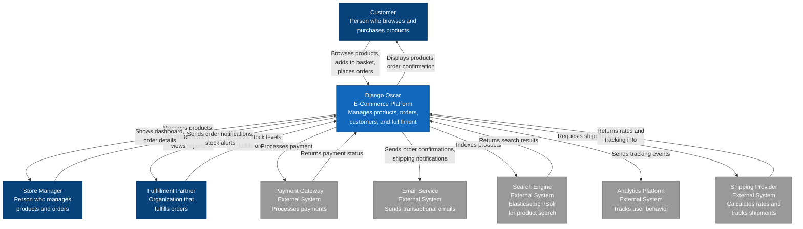

# C4 Context Diagram - Django Oscar E-Commerce System

## System Context (Level 1)

This diagram shows the Django Oscar e-commerce system in the context of users and external systems it integrates with.

## Key Elements

### People

**Customer**
- Browses the product catalogue
- Searches for products
- Adds products to basket
- Goes through checkout process
- Manages their account and order history
- Can checkout as guest or authenticated user

**Store Manager**
- Accesses the dashboard to manage the store
- Adds and updates products
- Manages categories and product attributes
- Processes and fulfills orders
- Manages promotions and vouchers
- Views analytics and reports

**Fulfillment Partner**
- External organization or warehouse
- Updates stock levels in the system
- Receives order notifications
- Marks orders as shipped
- Receives stock alerts when inventory is low

### System

**Django Oscar E-Commerce Platform**
- Central e-commerce system
- Manages the complete product catalog
- Handles shopping basket and checkout
- Processes orders through the fulfillment pipeline
- Manages customer accounts and addresses
- Coordinates with external systems for payment, search, shipping
- Provides admin dashboard for store management
- Supports multiple fulfillment partners

### External Systems

**Payment Gateway** (e.g., Stripe, PayPal, Braintree)
- Processes credit card and other payments
- Handles PCI compliance
- Returns transaction status to Oscar
- May handle refunds and chargebacks

**Email Service** (e.g., SendGrid, Amazon SES)
- Delivers transactional emails
- Order confirmations
- Shipping notifications
- Password resets
- Marketing communications

**Search Engine** (Elasticsearch, Solr, or Whoosh)
- Indexes product data
- Provides fast full-text search
- Supports faceted search and filtering
- Returns ranked search results

**Analytics Platform** (e.g., Google Analytics, Mixpanel)
- Tracks user behavior and conversions
- Records product views
- Monitors checkout funnel
- Provides business intelligence

**Shipping Provider** (e.g., FedEx, UPS, USPS)
- Calculates shipping rates
- Provides tracking numbers
- Updates shipment status
- Validates addresses

## Key Interactions

### Customer Journey
1. Customer browses products or searches catalog
2. Customer adds items to basket
3. Customer proceeds to checkout
4. Oscar validates availability with inventory
5. Oscar processes payment via Payment Gateway
6. Oscar creates order and sends confirmation via Email Service
7. Oscar notifies fulfillment partner
8. Oscar tracks analytics events

### Order Fulfillment
1. Partner receives order notification
2. Partner picks and packs items
3. Partner updates order status in Oscar
4. Oscar requests shipping label from Shipping Provider
5. Oscar sends shipping notification to Customer via Email Service
6. Customer can track shipment through Oscar

### Store Management
1. Store Manager logs into dashboard
2. Store Manager adds/updates products
3. Changes are indexed in Search Engine
4. Store Manager creates promotions
5. Store Manager processes orders
6. Store Manager views reports and analytics

## Deployment Context

Oscar typically runs as a web application with:
- Web application server (e.g., Gunicorn, uWSGI)
- Relational database (PostgreSQL recommended)
- Cache layer (Redis or Memcached)
- Static and media file storage (CDN, S3)
- Background task queue (Celery)

## Security Boundaries

- Customer data is protected within Oscar
- Payment data is handled by PCI-compliant gateway
- Admin dashboard requires authentication
- Partner access can be restricted by permissions
- API access can be controlled with authentication tokens
