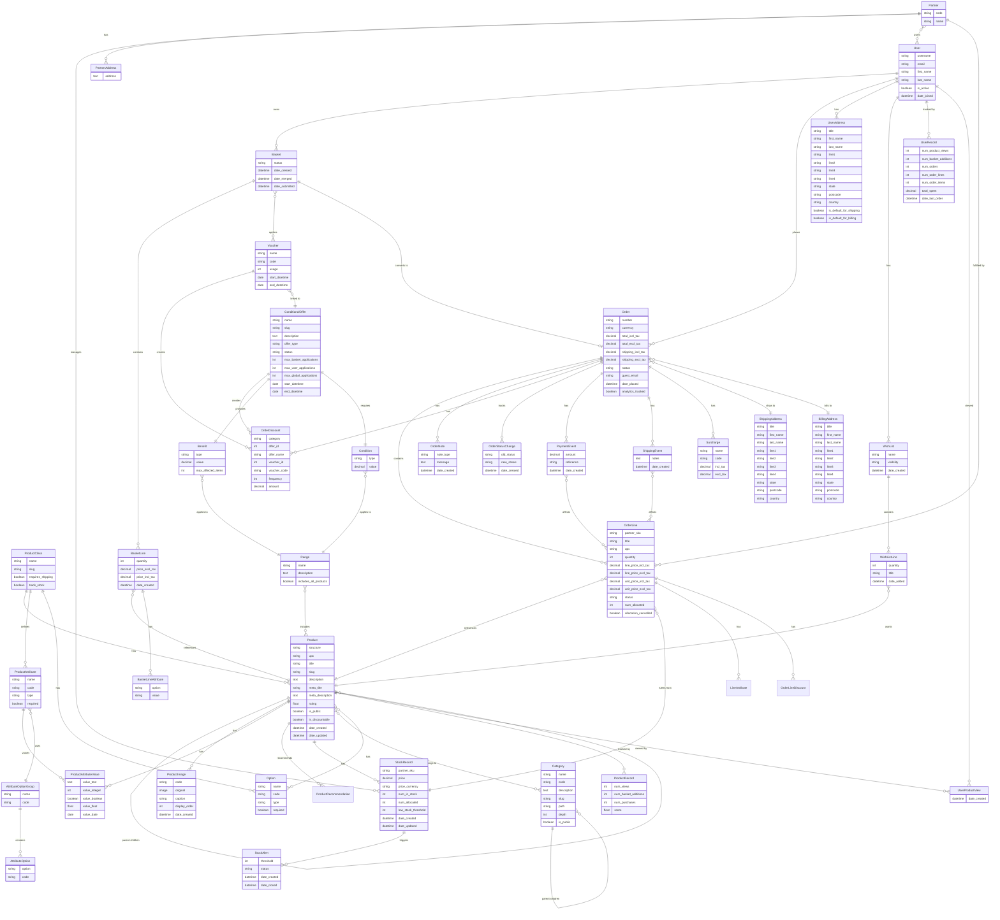
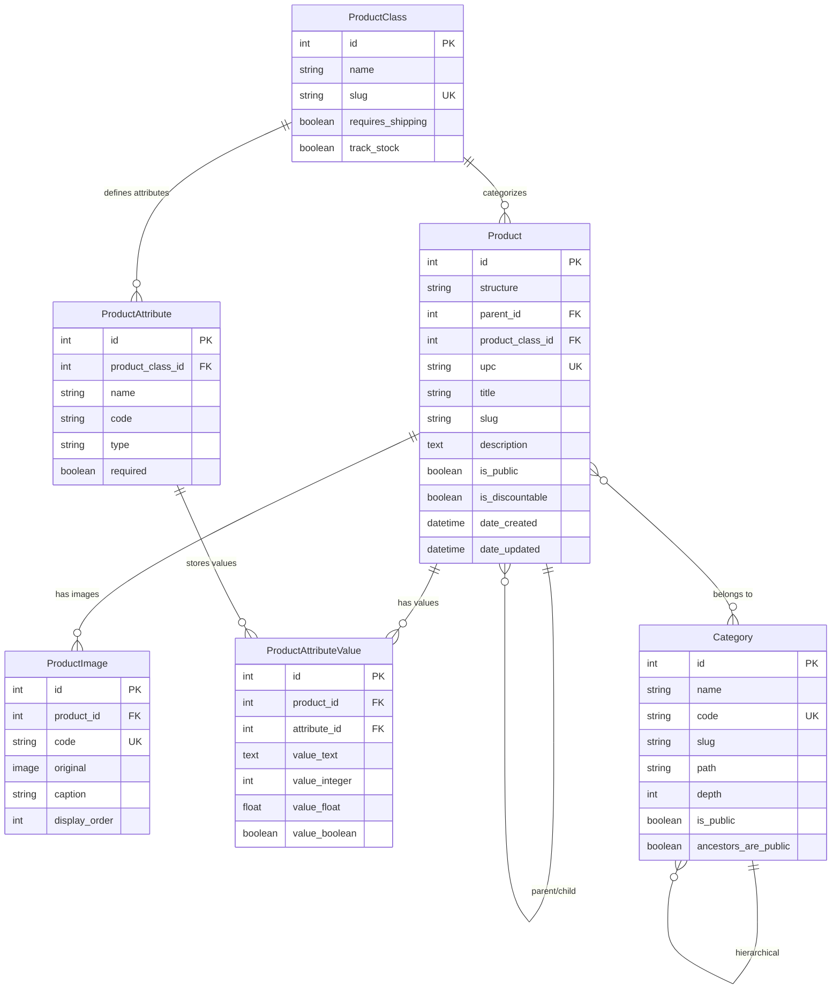
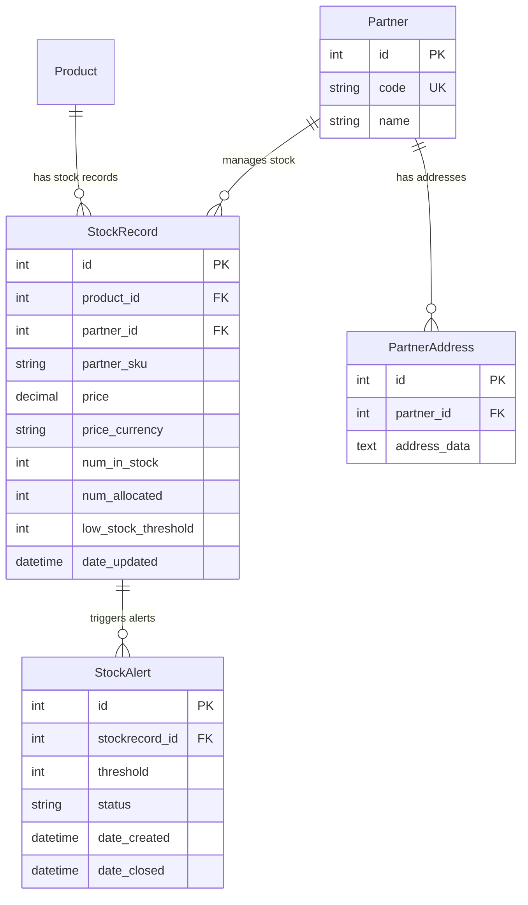
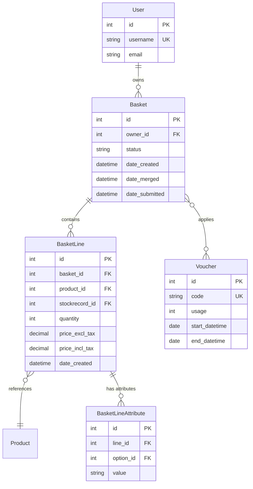
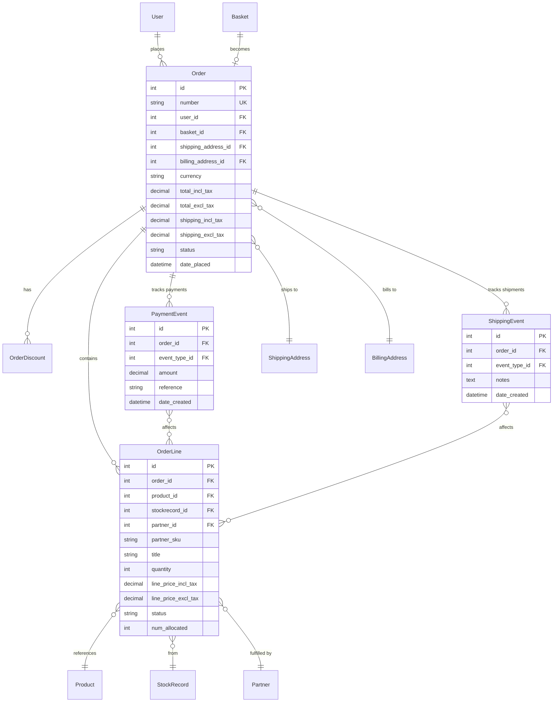
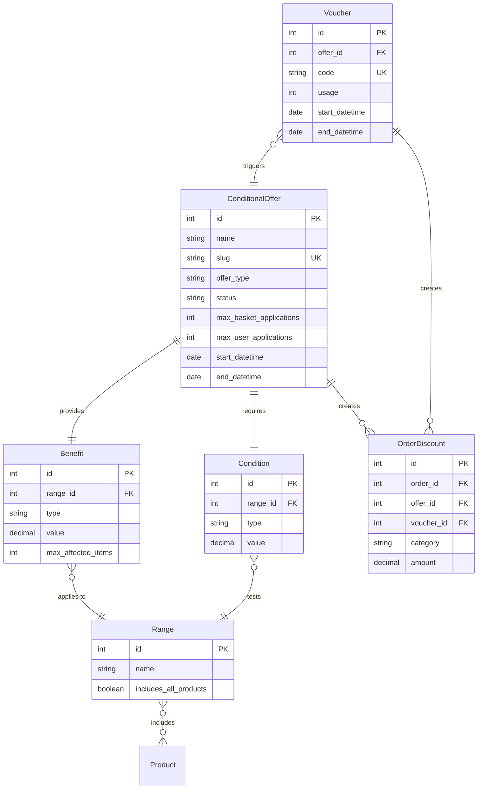

# Django Oscar Data Model - Entity Relationship Diagram

## Core Data Model Overview

This document provides entity relationship diagrams for Django Oscar's core data model, organized by domain.

## Complete Entity Relationship Diagram



## Domain-Specific ERDs

### 1. Catalogue Domain



**Key Relationships**:
- Product can be standalone, parent (with children), or child (of parent)
- ProductClass defines the type of product and its attributes
- Categories form a tree structure (using django-treebeard)
- ProductAttributeValue uses EAV pattern for flexible attributes

### 2. Partner and Inventory Domain



**Key Concepts**:
- **Two-Stage Stock Allocation**:
  - `num_in_stock`: Total physical inventory
  - `num_allocated`: Reserved for orders not yet shipped
  - `net_stock_level = num_in_stock - num_allocated`
- Multiple partners can stock the same product
- Each partner has their own SKU and pricing

### 3. Basket Domain



**Key Features**:
- Anonymous users have baskets stored in session
- Baskets merge when user logs in
- Line attributes store product options (e.g., personalized text)
- Vouchers applied at basket level

### 4. Order Domain



**Key Characteristics**:
- Orders are immutable after creation
- Product information denormalized (preserves historical data)
- Status pipeline controls order state transitions
- Many-to-many between events and order lines (via "through" tables)

### 5. Offer and Voucher Domain



**Offer Types**:
- **Site offers**: Apply automatically to all qualifying baskets
- **Voucher offers**: Require a voucher code
- **Session offers**: Temporary, for current session only

**Benefit Types**:
- Percentage discount
- Absolute discount
- Fixed price
- Free shipping
- Multibuy (e.g., 3 for 2)

## Key Indexing Strategy

### High-Priority Indexes

**Product**:
- `structure` - Filtering by product type
- `is_public`, `date_updated` - Public product queries
- `parent_id` - Parent-child lookups

**StockRecord**:
- `product_id`, `partner_id` - Joint lookup
- `date_updated` - Finding recently updated stock

**Order**:
- `number` - Order lookup
- `user_id`, `date_placed` - User order history
- `status`, `date_placed` - Order processing queries

**OrderLine**:
- `order_id` - Order lines lookup
- `product_id` - Product sales reports
- `partner_id` - Partner fulfillment queries

**Category**:
- `path` - Tree traversal (treebeard)
- `slug` - URL lookups

## Data Integrity Constraints

### Unique Constraints
- `Product.upc` - Universal Product Code
- `StockRecord.(partner, partner_sku)` - Partner's SKU
- `Order.number` - Order identifier
- `Voucher.code` - Voucher code

### Check Constraints
- Stock quantities >= 0
- Prices >= 0
- Order totals consistent with line totals

### Foreign Key Cascades
- `Product` deletion → CASCADE to `StockRecord`
- `Order` deletion → CASCADE to `OrderLine`
- `Product` deletion → SET_NULL in `OrderLine` (preserves orders)
- `User` deletion → SET_NULL in `Order` (preserves orders)

## Historical Data Preservation

### Denormalized Data in Orders
To preserve historical information, orders store copies of:
- Product title and SKU
- Partner name and SKU
- Prices at time of purchase
- Discount information

This ensures:
- Order display remains accurate even if products/partners are deleted
- Accurate historical reporting
- Audit compliance

## Performance Optimizations

### Select Related Usage
```python
Order.objects.select_related(
    'user', 'billing_address', 'shipping_address'
)
```

### Prefetch Related Usage
```python
Order.objects.prefetch_related(
    'lines__product__images',
    'shipping_events__event_type'
)
```

### Denormalization
- Order totals stored (not calculated on each view)
- Product rating cached
- Category full_slug cached
